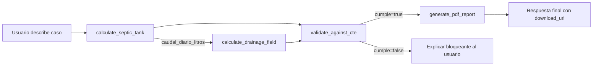

# Hydro_Agent — Paso 2: Composición de Tools

## Resumen

Pasamos de 1 tool a **4 tools que se componen** para resolver un caso completo de dimensionado de saneamiento individual. El agente puede ahora, en una sola conversación, encadenar:

```
calculate_septic_tank → calculate_drainage_field → validate_against_cte → generate_pdf_report
```

## Flujo entre tools



### Diagrama ASCII

```
  USER  ──▶ calculate_septic_tank ──▶ caudal_diario_litros
                                          │
                                          ▼
                                  calculate_drainage_field
                                          │
                  ┌───────────────────────┤
                  ▼                       ▼
          validate_against_cte    (resultados crudos)
                  │
        ┌─────────┴──────────┐
        ▼                    ▼
   cumple=false        cumple=true
        │                    │
        ▼                    ▼
   Explicar al        generate_pdf_report
   usuario            ──▶ download_url
```

## Tabla resumen de tools

| Tool | Cuándo se invoca | Inputs principales | Outputs principales |
|---|---|---|---|
| `calculate_septic_tank` | Usuario describe caso nuevo | `habitantes_equivalentes`, `tipo_uso` | `volumen_util_litros`, `dimensiones`, `caudal_diario_litros` |
| `calculate_drainage_field` | Tras la fosa, si aplica drenaje | `caudal_diario_l`, `permeabilidad_suelo_m_dia` | `tipo_sistema`, `dimensiones`, `validacion` |
| `validate_against_cte` | Tras los cálculos | `septic_tank`, `drainage_field`, `contexto` | `cumple`, `bloqueantes[]`, `advertencias[]` |
| `generate_pdf_report` | Final, si pide PDF | `septic_tank`, `drainage_field`, `validation`, `proyecto` | `report_id`, `download_url` |

## Ejemplos de curl

### Ejemplo 1 — Cálculo simple (solo fosa)

```bash
curl -X POST http://localhost:3000/api/agent \
  -H "Content-Type: application/json" \
  -d '{"message":"Dimensiona la fosa para una casa de 4 dormitorios."}'
```

Respuesta esperada: `toolCalls` con `calculate_septic_tank` únicamente.

### Ejemplo 2 — Encadenamiento completo

```bash
curl -X POST http://localhost:3000/api/agent \
  -H "Content-Type: application/json" \
  -d '{
    "message": "Vivienda unifamiliar 5 dormitorios en parcela rural, suelo K=1e-5 m/s, pozo de agua a 40 m. Dimensiona fosa y drenaje, valida normativa y genera memoria técnica en PDF."
  }'
```

Respuesta esperada: `toolCalls` con los 4 tools en orden. El `reply` final incluye `download_url`.

### Ejemplo 3 — Caso bloqueante (pozo a 15 m)

```bash
curl -X POST http://localhost:3000/api/agent \
  -H "Content-Type: application/json" \
  -d '{
    "message": "Misma vivienda pero el pozo está a 15 m de la fosa."
  }'
```

Respuesta esperada: `validate_against_cte` devuelve `cumple=false`, `bloqueantes[]` contiene `CTE-HS5-G-003` (CTE DB-HS 5 Anejo G.2). El agente NO procede a `generate_pdf_report` y explica el problema.

## Decisiones de diseño

### ¿Por qué 4 tools separados y no un solo `design_complete_system`?

**Composición vs. monolito.** Cada tool tiene una responsabilidad única:

- `calculate_septic_tank` puede usarse solo (cuando el usuario solo pide el tanque).
- `calculate_drainage_field` se reutiliza para casos con K conocido y caudal ya estimado.
- `validate_against_cte` es read-only y se invoca sobre cualquier subset de resultados.
- `generate_pdf_report` puede generar memorias parciales (solo tanque, sin drenaje).

Un único tool monolítico habría forzado al modelo a proporcionar TODOS los parámetros en una sola llamada, lo cual:
1. Aumenta el riesgo de alucinación (modelo inventa parámetros).
2. Hace imposible el "pre-cálculo": si el usuario solo pregunta por la fosa, no necesitas la permeabilidad.
3. Bloquea la trazabilidad: cada tool deja un log estructurado y un registro en `toolCalls`.

### ¿Por qué `pdfkit` y no `@react-pdf/renderer`?

- **No requiere SSR de React**: ahorra peso y complejidad en API routes.
- **Más rápido en serverless**: arranque menor, sin overhead de React DOM.
- **API imperativa**: encaja mejor con el flujo de generación lineal.

Si en el futuro se quiere una plantilla más rica con componentes reutilizables, se puede migrar a `@react-pdf/renderer` sin tocar la interfaz pública del tool.

### Guardrail de iteraciones (MAX_TOOL_ROUNDS = 8)

El bucle de tool use corta tras 8 iteraciones. Esto cubre el peor caso realista:
- 4 tools en cadena (4 rounds)
- 1 round para respuesta final
- 3 rounds de margen para retries o aclaraciones

Si se alcanza el límite, se devuelve el último texto del modelo (o un mensaje de fallback) y los `toolCalls` recopilados hasta ese punto.

### Logs estructurados (preparados para Langfuse)

Cada `tool_use` registra:

```
[agent.tool] name=<tool> duration=<ms> outcome=<success|error> input=<truncated>
```

Esto permite, en Paso 6, exportar los logs a Langfuse sin cambiar la lógica del bucle.

### Validación: read-only por diseño

`validate_against_cte` es **estrictamente read-only**: no recalcula, no modifica, solo lee y categoriza. Esto:
1. Permite validar manualmente outputs antes de generar el PDF.
2. Hace el tool determinista y trivialmente testeable.
3. Separa el qué (cálculo) del cómo se evalúa (validación normativa).

## Tests

```bash
npx vitest run
```

Esperado: 29/29 tests passing:
- 7 tests de septic tank (Paso 1)
- 7 tests de drainage field (Paso 2)
- 8 tests del CTE validator (Paso 2)
- 7 tests de composición de tools (Paso 2)

## Estructura final

```
lib/
├── calculations/
│   ├── septicTank.ts                  (Paso 1)
│   └── drainageField.ts               (Paso 2 — NEW)
├── validation/
│   └── cteValidator.ts                (Paso 2 — NEW)
├── reports/
│   └── generatePdfReport.ts           (Paso 2 — NEW)
└── agent/
    └── tools/
        ├── calculateSepticTank.ts     (Paso 1)
        ├── calculateDrainageField.ts  (Paso 2 — NEW)
        ├── validateAgainstCte.ts      (Paso 2 — NEW)
        ├── generatePdfReport.ts       (Paso 2 — NEW)
        └── index.ts                   (UPDATED)

app/api/agent/route.ts                 (UPDATED)
public/reports/                        (NEW — auto-created)

__tests__/
├── calculations/
│   ├── septicTank.test.ts             (Paso 1)
│   └── drainageField.test.ts          (Paso 2 — NEW)
├── validation/
│   └── cteValidator.test.ts           (Paso 2 — NEW)
└── agent/
    └── toolComposition.test.ts        (Paso 2 — NEW)

docs/agent/
├── STEP-1-tool-use.md                 (Paso 1)
└── STEP-2-tool-composition.md         (Paso 2 — este archivo)
```

## Próximos pasos (fuera de alcance ahora)

- **Paso 3**: integración con UI (`SepticTankCalculator.jsx`).
- **Paso 4**: RAG sobre normativa con pgvector + embeddings.
- **Paso 5**: streaming de respuestas con Vercel AI SDK.
- **Paso 6**: observabilidad con Langfuse.
- **Paso 7**: persistencia de proyectos por usuario (Supabase Auth).
