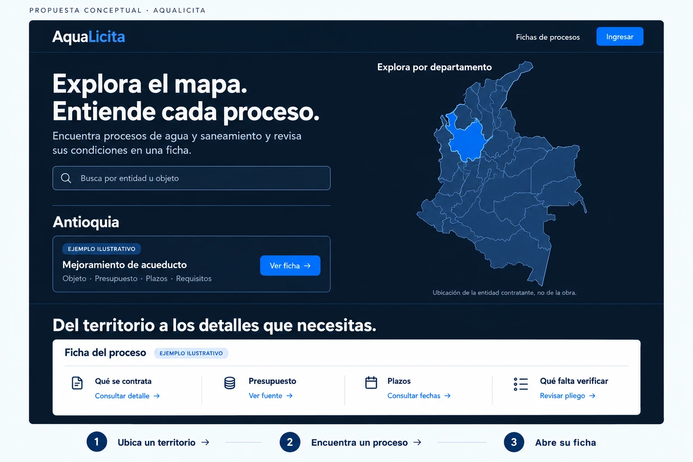

# AquaLicita — Spec del hero «Explora el mapa. Entiende cada proceso.»

**Fecha:** 2026-10-02. **Versión:** 1.0, para revisión y traspaso a Claude Code.
**Tipo:** especificación de producto, diseño e interacciones; no es código implementado.
**Referencia visual aprobada:** [imagen completa](2026-10-02-hero-mapa-ficha/referencia-aprobada.png).
**Reconocimiento técnico:** checkout `1d39870`, rama `codex/ficha-movil-interactiva`, inspeccionado el 2026-10-02. Revalidar estos hechos al comenzar; no asumir que esta rama es la base correcta para implementar.

> Revalidación sobre `main` (`c533b45`) y divergencias que piden decisión: ver
> [el plan](../plans/2026-10-02-hero-mapa-ficha.md) §1.



## 1. Encargo y autoridad del documento

El usuario aprobó **esta imagen concreta**, y pidió un spec detallado para llevarla a Claude Code. No pidió otra exploración visual ni una mejora genérica de la portada. La implementación debe reconocerse como esta composición: titular grande a la izquierda, buscador, departamento y una tarjeta de proceso; mapa grande a la derecha; debajo, un titular y una franja blanca con cuatro entradas a la ficha.

La dirección visual está aprobada. Este documento concreta comportamientos, adaptación móvil y estados que una imagen estática no muestra. Esas concreciones son decisiones propuestas de este spec, no decisiones que el usuario haya aprobado individualmente. Antes de implementar, revisar el documento completo y preparar un plan separado; no interpretar la aprobación del boceto como aprobación del código, del despliegue o de cambios de dominio.

Orden para resolver contradicciones:

1. La solicitud del usuario y la imagen adjunta fijan la composición deseada.
2. Este spec define contenido real, interacciones, excepciones al boceto y aceptación.
3. Las reglas vigentes del repositorio siguen mandando en datos, seguridad y despliegue.
4. El código actual es la evidencia de lo que existe; no es una obligación de conservar una composición visual que este spec sustituye expresamente.

No implementar una versión que conserve el hero viejo y solo cambie su titular. Tampoco utilizar la imagen como fondo o como interfaz rasterizada.

## 2. Objetivo y experiencia que se vende

**Propuesta:** explorar territorialmente los procesos de agua y saneamiento, encontrar uno concreto y entrar en su ficha para entender sus condiciones y qué falta verificar.

Usuario principal: visitante que busca oportunidades del sector, con o sin cuenta. No hace falta conocer la palabra «compuerta», crear un perfil o registrarse para entender y comenzar este recorrido.

El visitante debe poder responder:

- ¿Qué encuentro aquí? Procesos de agua y saneamiento del SECOP II.
- ¿Para qué sirve el mapa? Explorar según la ubicación de la entidad contratante.
- ¿Qué hago con un proceso? Abrir su ficha.
- ¿Qué veré dentro? Objeto, presupuesto, plazos y requisitos por verificar, con las limitaciones de las fuentes.

La portada no certifica elegibilidad. No afirma que todos los presupuestos, fechas o pliegos estén disponibles. No convierte la sede de la entidad en lugar de ejecución. No presenta el diagnóstico general como si alimentara por sí solo el semáforo individual.

## 3. Alcance cerrado

### Incluido

- Recomposición del hero según la referencia, conservando dos columnas en escritorio.
- Copy exacto de la referencia, con las sustituciones de datos ilustrativos que se detallan abajo.
- Un proceso real destacado por departamento, con acceso directo a su ficha.
- Franja blanca debajo del hero, sustituyendo el contenido actual de Ficha Viva, con cuatro accesos a secciones reales de **ese mismo proceso**.
- Estados de carga, vacío, error, datos incompletos y cambios rápidos de departamento.
- Adaptación a móvil, teclado, lector de pantalla y JavaScript desactivado.
- Conservación de mapa, leyendas, opciones, búsqueda, rutas y fuentes existentes.
- Pruebas, comparación visual con la imagen y documentación de las decisiones sustituidas.

### Excluido

- Rediseñar las páginas de ficha, facetas, cuenta, precios o diagnóstico.
- Cambiar ingesta, definición de abierto, clasificación, permisos o base de datos.
- Crear APIs, nuevas consultas de servidor, autenticación o personalización de la portada.
- Añadir una biblioteca de mapas, iconos, animaciones, fuentes o UI.
- Crear seguimiento, alertas nuevas, formularios de captación o promesas de correo.
- Reintroducir ticker, estadísticas nacionales prominentes, tendencias, tercera columna, carrusel, árbol de decisiones o nuevas secciones de marketing.
- Instrumentación analítica nueva. La medición de conversión se plantea como evaluación posterior, sin transmitir datos nuevos en este trabajo.

## 4. Qué se reproduce de la imagen y qué se adapta

| Elemento de la imagen | Decisión de producción |
|---|---|
| Titular de dos frases grande | Reproducir texto, jerarquía, alineación y peso. No mantener el tamaño pequeño del hero anterior. |
| Texto, buscador y resultado a la izquierda | Reproducir orden, alineación y espacios relativos. |
| «Antioquia» | Nombre del departamento seleccionado, procedente de datos. No fijar Antioquia en código. |
| Una tarjeta con título y «Ver ficha» | Una tarjeta real, de la fuente actual de destacados. No tres filas como antes. |
| «Mejoramiento de acueducto» | Sustituir por el objeto real; no sembrar un proceso de ejemplo en producción. |
| Chip «EJEMPLO ILUSTRATIVO» de la tarjeta | Sustituir por «PROCESO SECOP II». Es contenido real, no una demo. |
| Mapa y contorno seleccionado | Usar geometría real y mecanismos existentes. El mapa generado no es cartografía válida. |
| Rellenos azules del mapa | Conservar la rampa y las clases por datos. La selección se marca por contorno, no cambiando el significado del relleno. |
| Franja blanca «Ficha del proceso» | Reproducir como panel compacto de acceso a la ficha del proceso mostrado arriba. |
| Chip «EJEMPLO ILUSTRATIVO» de la franja | Sustituir por «QUÉ ENCONTRARÁS». El panel describe contenidos; no inventa sus valores. |
| Cuatro columnas con iconos y enlaces | Reproducir; sus destinos se fijan en §8. No controles decorativos que parezcan enlaces. |
| Marco exterior claro y «PROPUESTA CONCEPTUAL» | Son presentación del boceto; no forman parte del sitio. La página mantiene su fondo oscuro. |
| Franja exterior «1. Ubica… 2. Encuentra… 3. Abre…» | Es anotación explicativa del boceto, no una tercera sección a implementar. El recorrido se expresa con la interacción. |
| Logotipo recreado y navegación abreviada | Conservar identidad y navegación existentes. No sustituir el logo ni retirar enlaces globales porque la imagen los omita. |
| Azul eléctrico y resplandores de la imagen | Usar colores ya medidos del producto. No incorporar efectos de brillo ni extraer colores aproximados del PNG. |

**La fidelidad se evalúa en composición, escala, tipografía, agrupación y protagonismo.** Las diferencias enumeradas son intencionales y necesarias para transformar una ilustración en producto real.

## 5. Composición y medidas de referencia

Las medidas siguientes son objetivos de implementación derivados de un PNG de 1536 × 1024, no mediciones de Figma ni valores extraídos de un archivo de diseño. La imagen tiene márgenes y anotaciones exteriores que no se copian. Comparar proporciones del área útil, no cada coordenada absoluta del PNG.

### 5.1 Escritorio, ancho de viewport ≥ 1200 px

- Contenedor de contenido de aproximadamente 1320 px máximo, centrado; compartir exactamente sus bordes con la sección inferior.
- Márgenes laterales fluidos, al menos 32 px; alrededor de 48 px cuando haya espacio. No sumar dos capas de padding que encojan la composición.
- Hero: dos columnas cercanas a 1:1, separación de 40–56 px. Objetivo: zona izquierda de aproximadamente 560–620 px en una pantalla ancha, mapa en el espacio restante.
- **Se sustituye el límite anterior de 380 px para el mensaje.** Ese ancho no reproduce la imagen aprobada. La nueva anchura no autoriza a reducir el mapa hasta convertirlo en un adorno.
- Alineación superior de las columnas; el título del mapa queda cerca del inicio del titular. Espacio superior de 36–48 px y espacio inferior de 24–32 px, sin alturas rígidas que corten contenido.
- Titular: Inter existente, peso 700, 52–60 px, interlineado 1.05–1.1, tracking aproximado −0.025em. Primera frase en su línea; la segunda puede ocupar otra o dos según el ancho. Nunca impedir el ajuste con `white-space: nowrap`.
- Texto de apoyo: 20–22 px, interlineado 1.45; máximo aproximado de 48 caracteres por línea. Separación del titular 16 px.
- Buscador: ancho de la columna, alto mínimo 52 px, radio 10–12 px, separación superior 20–24 px.
- Filete entre buscador y territorio: 1 px, margen superior 28–32 px y separación inferior 16–20 px.
- Departamento: 30–34 px, peso 700; admite varias líneas sin empujar lateralmente el botón.
- Tarjeta de proceso: padding 18–20 px, borde de 1 px, radio 10–12 px, fondo oscuro ligeramente elevado. Título 18–20 px/1.3; texto secundario 14–15 px.
- Botón «Ver ficha»: 44–48 px de alto, padding horizontal 20–24 px, radio 8–10 px; forma de rectángulo redondeado de la referencia, no la píldora del hero anterior.
- Columna derecha: mapa real centrado; superficie continental claramente protagonista. Objetivo de alto visible del SVG 400–510 px en escritorio ancho, ajustado a su relación real y al espacio disponible. No estirar ni recortar departamentos.
- Cabecera del mapa 18–20 px, peso 600/700. Leyenda y aclaraciones 12–14 px, legibles.
- Opciones y lista, ausentes en el dibujo, permanecen como controles discretos; no compiten con «Ver ficha».

### 5.2 Franja de ficha inmediatamente debajo

- Sigue siendo el segundo bloque de la portada. Reemplaza la explicación anterior de cuatro preguntas; no se añade antes o después de ella.
- Separación por filete horizontal y padding superior de 24–32 px. Fondo exterior oscuro plano y continuo con el hero.
- Titular «Del territorio a los detalles que necesitas.»: 34–40 px en escritorio ancho, peso 700, interlineado 1.15. Máximo dos líneas; no forzar el ancho de 22ch anterior.
- Panel claro a 12–16 px del titular, ancho completo del contenedor, radio 8–12 px, padding 20–24 px.
- Cabecera «Ficha del proceso» de 22–24 px, chip a su lado con wrap natural. Línea inferior de 1 px.
- Cuatro columnas iguales en escritorio, con separadores verticales finos. Cada una: icono lineal de 26–30 px, título de 16–18 px y enlace de 15–16 px.
- Altura natural aproximada 170–210 px del panel en escritorio; admite más cuando el texto crece. Nunca recortar para alcanzar esa cifra.
- Una línea auxiliar bajo el panel conserva «Cómo razona la ficha» y aclara «La disponibilidad de presupuesto, fechas y requisitos depende de las fuentes de cada proceso». No restaurar los párrafos extensos anteriores.

### 5.3 Pantallas intermedias y móvil

| Ancho | Disposición |
|---|---|
| 900–1199 px | Dos columnas con `minmax(0, 1fr)`, gap 24–32 px; H1 38–46 px; apoyo 17–19 px. Franja blanca 2 × 2. Botón debajo del título si no cabe sin comprimirlo. |
| 600–899 px | Una columna: mensaje y buscador → mapa y sus controles → departamento y tarjeta → franja blanca. H1 36–42 px. Panel inferior 2 × 2. |
| 320–599 px | Mismo orden vertical. H1 32–36 px; apoyo 17–18 px. Márgenes 16–20 px. Tarjeta en una columna, CTA de ancho completo. Franja blanca con cuatro filas y divisores horizontales. |

- En móvil no poner el panel blanco entre el mapa y el proceso: rompería el recorrido.
- No mostrar simultáneamente copias «desktop» y «mobile» de los controles. Un solo input, un mapa, una tarjeta y un panel.
- Orden visual y navegación por teclado deben ser comprensibles en ambos modos; comprobar expresamente la reordenación CSS. No corregir con `tabindex` positivos.
- A 320 px no debe existir desplazamiento horizontal de página, texto solapado ni CTA fuera del contenedor.
- Mantener ocultación de rótulos pequeños del mapa bajo 600 px y su ajuste de encuadre actual; no perder San Andrés por el recorte.
- El contenido puede necesitar scroll, especialmente en móvil y con zoom. No sacrificar la escala del diseño para obligar a que toda la portada quepa en el primer pantallazo.
- En 1440 × 900 y texto habitual debe verse el hero completo y comenzar la sección inferior; la franja inferior completa puede requerir desplazamiento. La antigua exigencia de encajar todos los elementos con tres procesos no se traslada literalmente a este diseño.

## 6. Copy exacto y jerarquía de acciones

| Posición | Texto |
|---|---|
| H1 | Explora el mapa. Entiende cada proceso. |
| Apoyo | Encuentra procesos de agua y saneamiento y revisa sus condiciones en una ficha. |
| Placeholder | Busca por entidad u objeto |
| Nombre accesible del input | Buscar fichas de procesos abiertos por entidad u objeto |
| Cabecera del mapa | Explora por departamento |
| Nota territorial, visible | Ubicación de la entidad contratante, no de la obra. |
| Chip de tarjeta real | PROCESO SECOP II |
| Línea descriptiva de tarjeta | Objeto · Presupuesto · Plazos · Requisitos |
| CTA principal | Ver ficha → |
| H2 inferior | Del territorio a los detalles que necesitas. |
| Cabecera de panel claro | Ficha del proceso |
| Chip del panel | QUÉ ENCONTRARÁS |
| Ayuda bajo panel | La disponibilidad de presupuesto, fechas y requisitos depende de las fuentes de cada proceso. |
| Enlace de metodología | Cómo razona la ficha → |

El título de la tarjeta es el objeto real, no un nuevo resumen generado. Conservar normalización tipográfica existente. Si no hay objeto, mostrar «Proceso sin objeto publicado», sin usar la entidad como si fuese el objeto. En el nombre accesible del enlace puede añadirse entidad e identificador para distinguirlo.

La línea «Objeto · Presupuesto · Plazos · Requisitos» indica temas de la ficha; no afirma que estén completos. No añadir una cuantía o fecha a esta tarjeta para rellenar espacio: la referencia no las muestra y la API de resumen no resuelve todos esos campos.

Acción de mayor jerarquía en el contenido del hero: **Ver ficha**, enlazada al proceso real. Retirar el botón lleno genérico «Ver fichas de procesos» situado actualmente bajo el buscador. Conservar como texto secundario «Ver todos los procesos de {departamento} →» hacia su faceta, debajo de la tarjeta. Sin departamento utilizable, el enlace alternativo será «Explorar todos los procesos →» hacia `/licitaciones`.

No mantener cifras nacionales ni porcentaje del departamento como protagonistas junto al nuevo bloque. Los datos siguen alimentando el mapa, la lista, sus nombres accesibles y las notas de cobertura. La funcionalidad de cálculo no debe borrarse si tiene otros usos.

## 7. Territorio, selección y proceso mostrado

### 7.1 Estado inicial y elección

- Con agregados disponibles, elegir inicialmente la primera fila válida con `n > 0` del orden entregado por el servidor. Hoy ese orden es descendente por conteo. No ordenar aleatoriamente, geolocalizar ni fijar Antioquia.
- Si no existe tal fila, no elegir departamento ni hacer una solicitud con clave vacía.
- El nombre encima de la tarjeta siempre identifica el **departamento confirmado** de su proceso. No reemplazar ese nombre por otro territorio al pasar el puntero mientras se conserva la tarjeta anterior.
- La lista plegable existente permite confirmar un departamento sin abandonar la portada. Sus botones conservan `aria-pressed`; al elegir, se actualizan contorno, título y proceso.
- Mantener «Opciones del mapa» y la lista plegable. Junto a la lista, ayuda breve: «Elige en la lista para ver una ficha aquí; abre un departamento del mapa para ver todos sus procesos». No mostrar esta instrucción si no hay datos.

### 7.2 Clic del mapa: decisión conservada expresamente

**El clic, toque o Enter sobre un enlace del mapa sigue navegando a la faceta del departamento.** No interceptar su navegación para convertirlo silenciosamente en selector; sigue siendo la decisión D del proyecto. Abrir en pestaña nueva y copiar enlace deben funcionar.

La imagen no define lo que sucede al clicar. Este spec conserva el comportamiento ya acordado y proporciona selección local mediante la lista. El recorrido mapa → proceso → ficha admite por tanto dos caminos reales:

1. Mapa → faceta del territorio → ficha de un proceso.
2. Departamento elegido inicialmente o en la lista → tarjeta del hero → ficha directa.

No afirmar en textos de interfaz que clicar el mapa actualiza la tarjeta. Cambiar esta decisión requiere una revisión explícita del spec, no una reinterpretación de la imagen por Claude Code.

### 7.3 Puntero y foco: vista previa sin ambigüedad

- Pasar por un departamento o enfocarlo conserva el resaltado del mapa y de la lista, sin consultar la API.
- Su nombre y conteo de vista previa se muestran en una línea reservada dentro del panel del mapa, distinta del título del territorio confirmado: «{Nombre}: {N} procesos abiertos». Al salir, vuelve a una ayuda neutral. No usar tooltip flotante.
- La tarjeta, sus enlaces y el panel blanco permanecen asociados al departamento confirmado. No atenuarlos a 45 % ni reducir su contraste para representar el hover de otro territorio.
- La vista previa de puntero no se anuncia como región viva. El nombre accesible del enlace del mapa ya cubre la navegación por teclado.
- No robar el foco ni desplazar automáticamente la página al elegir departamento. Anunciar una sola vez el resultado cargado mediante estado discreto accesible.

### 7.4 Qué proceso se destaca

- Reutilizar `GET /api/departamento/{codigoDIVIPOLA}/resumen`.
- La API actual entrega hasta tres procesos ordenados por presupuesto descendente, nulos al final, y fecha de publicación descendente. No alterar esta consulta ni añadir otra.
- Presentar **solo el primer elemento** como tarjeta. No carrusel, rotación, pestañas ni tres filas. El enlace a todos permite explorar el resto.
- Es una muestra según el orden existente, no «la mejor oportunidad», ni recomendación personalizada, ni proceso al que el usuario pueda necesariamente presentarse.
- Usar la ruta `ficha` real devuelta por la API. Si no es una ruta interna válida de detalle `/licitaciones/{slug-con-id}`, tratar el destacado como no disponible; no sustituir «Ver ficha» por un enlace al listado sin avisar.
- Verificar identidad, objeto y ruta del primer elemento antes de publicarlos en el estado compartido. No aceptar URLs externas, esquemas ejecutables o rutas de cuenta como destino.
- No recorrer otros departamentos ni solicitar los 33 resúmenes para completar un vacío. Una elección produce como máximo una solicitud de resumen, aparte del comportamiento de desarrollo de React y reintentos explícitos.

## 8. Panel blanco: cuatro accesos al mismo proceso

Este panel **no es una captura**, no es un segundo proceso y no contiene datos simulados. Es una presentación compacta de las áreas que el visitante puede revisar. El proceso activo es exactamente el de «Ver ficha», con una única fuente de estado compartido.

| Título | Enlace visible | Destino con destacado válido | Significado |
|---|---|---|---|
| Qué se contrata | Consultar detalle → | `{ficha}#ficha-resumen` | Resumen y objeto del proceso. |
| Presupuesto | Ver fuente → | `{ficha}#ficha-dinero` | Sección Dinero y sus fuentes; no descarga directa ni apertura automática de un PDF. |
| Plazos | Consultar fechas → | `{ficha}#ficha-plazos` | Fechas publicadas y sus limitaciones. |
| Qué falta verificar | Revisar pliego → | `{ficha}#pliego` | Área de pliego en Participar; puede ofrecer subida si no hay uno procesado. |

Estos hashes están soportados por `src/components/secop/ficha/ExploradorFicha.tsx` en la base inspeccionada. Validarlos de nuevo en la rama de implementación. No inventar `#presupuesto`, `#requisitos` o una ruta `/pliego` retirada.

- Todos son enlaces nativos, misma pestaña, con la posibilidad habitual de abrir en otra. No activar autenticación en la landing ni saltarse las protecciones del destino.
- «Revisar pliego» lleva a comprobar su disponibilidad, no promete que exista PDF ni extracción. La subida seguirá exigiendo sesión desde la acción existente.
- Los nombres accesibles deben contextualizar el proceso sin convertir el texto visible en un párrafo. Por ejemplo: «Consultar fechas de {objeto}».
- En carga, vacío, error o ausencia de proceso: conservar los cuatro títulos, iconos y explicaciones breves, pero sustituir los enlaces por texto normal, sin flechas y sin `href="#"`.
- Las explicaciones sin destino serán «Objeto del proceso», «Valor y fuentes disponibles», «Fechas publicadas» y «Requisitos según el pliego».
- Añadir estado visible «Los accesos se habilitan cuando hay un proceso disponible». No dejar enlaces al proceso anterior durante un cambio.
- Conservar siempre «Cómo razona la ficha» → `/licitaciones/como-participar#como-razona`, que no depende del destacado.
- No reintroducir el esquema y árbol antiguos de `ComoRazonaFicha`; permanecen en su página. La franja nueva sustituye los cuatro párrafos de Ficha Viva, no los acompaña.

## 9. Estados y coherencia asíncrona

| Situación | Tarjeta y territorio | Panel blanco / navegación |
|---|---|---|
| HTML inicial con datos territoriales | Nombre inicial real; reserva de espacio con «Cargando proceso…». Ningún objeto ficticio. | Cuatro áreas informativas, aún sin enlaces de proceso. Mapa y enlaces generales útiles. |
| Resumen válido con ≥ 1 elemento | Tarjeta del primer proceso y CTA real. | Los cuatro enlaces apuntan a su misma ficha. |
| Resumen válido `destacados: []` | «No hay un proceso destacado disponible en este departamento». No asegurar que no existen procesos en toda la base. | Sin enlaces de proceso; conservar enlace a faceta. |
| HTTP fallido, red o payload inválido | «No pudimos cargar el proceso. Inténtalo de nuevo.» y botón textual «Reintentar». | Sin destinos obsoletos; enlace a faceta sigue disponible. |
| Cambio A → B en carga | Encabezado B; retirar inmediatamente título y href de A; carga para B. | Se retiran los cuatro href de A hasta resolver B. |
| Respuesta tardía de A después de B | Ignorar A o cancelar su solicitud. | Nunca mezclar tarjeta B con enlaces A. |
| Regreso a departamento en caché | Reutilizar resultado de esa clave según política vigente; no pedir duplicados durante la misma sesión de página. | Publicar todos los destinos de forma coherente. |
| Total nacional 0, datos disponibles | «Colombia» y «No hay procesos abiertos disponibles». No confundir con error. | Enlace general y metodología; mapa sin procesos según modelo. |
| Fallo de agregados / total ausente | «No hay datos territoriales disponibles en este momento». Mapa sin datos, sin selección y sin cifras de demostración. | Buscador sigue disponible porque usa otra ruta; enlaces generales y metodología. |
| Hay total nacional, ninguna geografía utilizable | «No hay procesos con ubicación resuelta para mostrar aquí». | Búsqueda y listado nacional; no asignar procesos sin geografía a Antioquia. |
| Mapa no recibido | Mensaje «El mapa no está disponible en este momento». Si hay filas válidas, lista y tarjeta siguen funcionando. | No sustituir geometría por imagen inventada. |
| Objeto ausente | «Proceso sin objeto publicado». | Ficha válida sigue accesible. |
| Identificador o ruta de ficha inválidos | No mostrar CTA de ficha; estado de destacado no disponible. | Sin enlaces falsos; listado departamental disponible. |

### Reglas de implementación del estado

- Mantener una identidad de departamento en cada resultado asíncrono. No usar solo `loading: false` y un objeto suelto.
- No permitir dos componentes que consulten el mismo resumen independientemente. Compartir estado entre hero y Ficha Viva en su padre común o mediante un contrato equivalente acotado.
- No introducir una librería global de estado ni persistencia en navegador. El estado pertenece a esta visita y no contiene datos de cuenta.
- El botón de reintento evita solicitudes simultáneas y vuelve al mismo departamento; no cachear el error como si fuera un resultado vacío válido.
- Los errores técnicos deben diagnosticarse sin volcar payloads completos ni datos de cuenta. El usuario recibe el mensaje acordado, no una excepción cruda.
- La respuesta HTTP 200 con `[]` sí es un resultado vacío; JSON incorrecto, shape inválido o error HTTP son errores. No confundirlos con «sin procesos».
- Mantener altura mínima razonable para tarjeta y panel durante carga. Sin animación pulsante obligatoria ni esperas artificiales.

## 10. Mapa, datos y filtros que se conservan

- `app/page.js` conserva render de servidor y `revalidate = 21600` (6 h). No introducir cookies o lectura de sesión que dinamicen `/`.
- El SVG sigue llegando como prop `mapa`; no importar geometría, proyección o `ColombiaChoropleth` desde componentes de cliente.
- Datos territoriales: `agregadosPortada()` → `detallePorDepartamento()`. Mantener las cuatro consultas existentes, sin quinta consulta para este diseño.
- `condicionAbierto()` es la fuente de la condición de abierto: no duplicarla ni sustituirla por fecha o estado textual en el cliente.
- El total nacional incluye procesos sin geografía resuelta. No recalcularlo como suma de los departamentos. Conservar la nota de procesos sin ubicación del mapa cuando corresponda.
- La revalidación de 6 h no es la hora de ingesta ni una garantía de actualización diaria. No añadir «actualizado hoy», fecha ficticia o «en tiempo real».
- API de resumen: conservar `public, s-maxage=21600, stale-while-revalidate=3600` en éxito y 503 `no-store` en fallo. No ampliar su respuesta para alimentar la franja: solo necesita el href del proceso.
- La caché de agregados y la de resumen pueden diferir temporalmente. No forzar que sus cifras coincidan ni inventar datos cuando la segunda esté vacía.
- Opciones: procesos, monto en juego y cinco tipos desde `TIPOS_PROYECTO`/`TIPO_PROYECTO`.
- Elegir monto limpia tipo; elegir tipo cambia a modo de conteo por tipo. Conservar el comportamiento existente y sus pruebas.
- **Las opciones modifican el color del mapa, no filtran el proceso destacado ni el buscador.** Cuando haya tipo activo, mostrar ayuda: «El tipo cambia el mapa. La ficha mostrada corresponde al destacado general del departamento». No presentar un destacado de acueducto como resultado del filtro PTAR.
- La leyenda visible debe corresponder al modo. Mantener ocultación de rótulos de conteo cuando no correspondan a la métrica, patrón para cero y escalas existentes.
- Mantener contorno separado de selección (`.clr-mapa__marca`), copia del atributo `d` y tratamiento de San Andrés; no reordenar nodos SVG administrados por React.

## 11. Buscador

Reutilizar `BuscadorFichas.jsx`; cambia su presentación y placeholder, no su motor.

- Búsqueda nacional en objeto y entidad, no municipio ni departamento seleccionado. No enviar filtros territoriales implícitos.
- Mínimo 3 caracteres, espera actual de 300 ms, máximo 120 caracteres, hasta cinco resultados.
- Preservar parámetros actuales de `/api/secop`, cancelación de solicitudes antiguas y escape correcto del término en la URL.
- Elegir un resultado abre su ficha directamente; no sustituye el destacado territorial ni sincroniza el mapa.
- Enter envía a `/licitaciones/explorar?q=…`; formulario GET utilizable sin JavaScript. No convertir el buscador en un botón ficticio.
- Conservar estados de buscando, sin resultados y error; el error ofrece continuar al explorador.
- Flecha abajo entra a resultados, arriba/abajo los recorren, Escape cierra y salir del formulario cierra. Foco visible en cada enlace.
- El panel puede superponerse temporalmente a la tarjeta; debe quedar por encima de ella, no ser recortado por `overflow: clip` del hero ni quedar bajo el SVG.
- El panel debe caber horizontalmente a 320 px y seguir siendo desplazable/alcanzable con teclado cuando tenga cinco títulos largos.

## 12. Accesibilidad, temas y contenido extremo

- Un H1; H2 para territorio y franja; títulos del panel en nivel subordinado lógico. Regiones con nombres claros y enlaces nativos.
- Conservar «Saltar al contenido», navegación global y comportamiento de login existentes.
- Objetivos táctiles de controles HTML de al menos 44 × 44 px. Los departamentos SVG pequeños cuentan con alternativa HTML en la lista; no deformar la cartografía para agrandarlos.
- Contraste mínimo de texto normal 4.5:1 y texto grande 3:1; controles, bordes funcionales y foco 3:1 contra sus superficies adyacentes. Medir también placeholder, chip, notas y estados de carga.
- Tema oscuro exterior con `--aq-*` existentes. Panel claro mediante `.tema-claro` y sus alias locales; no heredar el cian oscuro como enlace sobre blanco.
- Fondo oscuro del hero `--aq-bg`; texto `--aq-text`, apoyo `--aq-muted` o su variante existente; botones `--aq-cta`/`--aq-cta-2`. En blanco usar `--text-primary`, `--text-muted`, `--border`, `--accent` y superficies del tema claro.
- No redefinir globalmente `--bg`, `--accent` ni `--surface`. La tarjeta blanca es una excepción local explícita de esta composición.
- Color no es el único indicador de selección o falta de procesos. Mantener contorno, nombre, estado accesible y patrón de cero.
- Iconos SVG sencillos, decorativos y `aria-hidden`; no descargar un paquete ni usar emojis como sustitutos del diseño.
- Título real de tarjeta: máximo tres líneas visuales en escritorio, cuatro en móvil. Conservar el texto completo en el DOM/nombre accesible, y permitir verlo completo en la ficha. No cortar a un número de caracteres destructivamente.
- Departamentos largos se ajustan en varias líneas, nunca se ocultan como única identificación. Probar «Archipiélago de San Andrés, Providencia y Santa Catalina».
- No truncar el CTA, los títulos de las cuatro áreas ni mensajes de error. Añadir `overflow-wrap` donde haga falta para identificadores o palabras excepcionalmente largas.
- Al cambiar proceso, anunciar brevemente «Proceso disponible de {departamento}»; no anunciar el panel completo cuatro veces. Carga con `aria-busy` y texto legible.
- Sin tabulaciones positivas, enlaces anidados, botones dentro de enlaces ni `div` clicables. El objeto y el CTA pueden formar un único enlace estilizado, con un solo destino y foco.
- Transiciones solo de color/borde de 120–180 ms; respetar `prefers-reduced-motion`. Sin desplazamiento suave forzado, autoavance ni efectos continuos.
- Zoom 200 %: contenido y controles íntegros; la disposición puede apilarse. Validar recorrido de foco, no solo captura.
- Sin JavaScript: mapa con enlaces, búsqueda GET, navegación general y metodología siguen funcionando. La consulta de destacados actual es de cliente: incluir mensaje `<noscript>` «Abre un departamento del mapa o utiliza el buscador para consultar sus fichas». No dejar únicamente «Cargando…» sin explicación. El panel no debe aparentar enlaces funcionales a un proceso inexistente.

## 13. Reconocimiento del código y puntos de integración

| Archivo existente | Rol actual | Cambio esperado / restricción |
|---|---|---|
| `app/page.js` | Agregados, SVG de servidor, Dataset JSON-LD, ISR | Mantener responsabilidades; no añadir consultas. |
| `src/components/landing/PortadaCliente.jsx` | Monta hero y Ficha Viva | Coordinar proceso activo/estado compartido sin duplicar fetch. |
| `hero-territorial/HeroTerritorial.jsx` | Selección, hover, opciones, composición | Nuevo diseño; separar vista previa del territorio confirmado. |
| `hero-territorial/FichaDepartamento.jsx` | Nombre, conteo, porcentaje | Adaptar uso en hero al encabezado de la referencia, sin estadísticas grandes; preservar helpers si se usan. |
| `hero-territorial/ResumenDepartamento.jsx` | Hook de resumen y tres filas | Una tarjeta real; estado explícito y propagación del destacado; error y reintento. |
| `hero-territorial/ListaTerritorios.jsx` | Selección por botones | Mantener alternativa accesible y elección local. |
| `hero-territorial/sincronia.js` | Contornos y pintura por clases | Reutilizar; no mutar orden de nodos ni convertir SVG a cliente. |
| `hero-territorial/BuscadorFichas.jsx` | Búsqueda y GET sin JS | Ajuste visual y copy; mantener contrato funcional. |
| `hero-territorial/hero-territorial.module.css` | Tema y responsive del hero | Nuevas proporciones, escala y tarjeta. Auditar overflow del buscador. |
| `ficha-viva/FichaViva.jsx` | Cuatro preguntas y enlaces | Sustituir por panel claro de cuatro entradas con destino compartido. |
| `ficha-viva/ficha-viva.module.css` | Estilos de portada y ComoRazonaFicha | Cambios acotados a nueva franja; no romper la página clara compartida. |
| `ficha-viva/ComoRazonaFicha.jsx` | Esquema y árbol fuera de portada | Sin cambios funcionales; prueba de regresión visual. |
| `src/components/landing/proceso-resumen.js` | Normaliza respuesta | Reutilizar cuando sea semánticamente correcto. No usar fallback de href a listado para CTA «Ver ficha». |
| `src/lib/secop/resumen-departamento.ts` y API | Fuente de tres destacados | Consumir primer elemento; no cambiar SQL ni límite de API. |
| `src/components/secop/ficha/ExploradorFicha.tsx` | Hashes de navegación | Solo verificar los destinos; no rediseñar. |

Las rutas de componentes abreviadas en la tabla parten de `src/components/landing/`.

Hallazgos que el implementador debe conocer:

1. El checkout local tiene un titular y estado inicial diferentes de la portada publicada vista el 2026-10-01. No usar aquella captura pública para reconstruir los detalles actuales del código.
2. El grafo Graphify contiene nodos históricos que ya no corresponden al cuerpo actual de algunos archivos. Se usó para localizar; los contratos de este spec se contrastaron leyendo el código.
3. `ResumenDepartamento` hoy agrupa errores y payload inválido como `empty`; este spec exige distinguirlos. Su caché en memoria se conserva como patrón, no como excusa para reutilizar una respuesta de otro departamento.
4. `mapApiItem` hoy permite fallback de href a `/licitaciones` y objeto a nombre de entidad. Esos fallbacks no sirven para la tarjeta de este diseño; no cambiar consumidores ajenos sin revisar impacto.
5. El formateador local de ese mapper no trata cero como ausente. La tarjeta propuesta no muestra cuantía; no incorporar ese dato ni abrir una refactorización de formato por este spec. Si se ampliara después, usar la política de `formatValorProceso` y probar cero/nulo.
6. Las pruebas actuales de hero/Ficha Viva fijan textos y estructura que este diseño sustituye. Actualizarlas para el nuevo contrato, conservando las garantías de datos, rutas, accesibilidad y ausencia de promesas falsas.

## 14. Decisiones anteriores sustituidas de manera limitada

| Decisión previa | Nuevo contrato |
|---|---|
| Izquierda como máximo 380 px | Columna amplia de la imagen, aproximadamente mitad del hero. |
| Tres destacados visibles | Un destacado y acceso a todos los del departamento. API sigue devolviendo tres. |
| Botón genérico lleno bajo buscador | CTA principal dentro de tarjeta real. |
| Ficha Viva solo cuatro preguntas oscuras | Titular y panel blanco de cuatro entradas, tal como la imagen aprobada. |
| Nombre del resultado cambia con hover; destacado anterior se atenúa | Nombre y tarjeta confirmados estables; vista previa territorial en panel del mapa. |
| Mostrar conteo y % en resultado | Se retiran del bloque principal de esta composición; siguen disponibles en datos y superficies pertinentes. |

No se sustituyen: clic del mapa hacia faceta, geometría real, rampas, dos zonas, límite de peso, lista/opciones, fuentes, condición de abierto, cachés, permisos y ausencia de nuevas secciones. Registrar estas excepciones en `CLAUDE.md`/`AGENTS.md` cuando se implemente, como cambio realizado y no antes.

## 15. Criterios de aceptación trazables

| ID | Criterio verificable |
|---|---|
| V01 | Comparación a 1440 px reconoce la misma composición de la imagen: titular grande, buscador, una tarjeta, mapa y panel blanco inferior. |
| V02 | No aparece hero antiguo de tres filas ni antigua sección de cuatro párrafos bajo el panel nuevo. |
| V03 | Se conservan márgenes alineados, escala relativa y dos columnas; no tercera columna ni mockup incrustado como PNG. |
| V04 | A 320, 390, 768, 1024, 1280 y 1440 px no hay overflow horizontal, solapamientos ni controles recortados. |
| V05 | Objeto largo y departamento largo no rompen tarjeta, mapa, CTA o panel inferior. |
| D01 | Nombre, objeto y href provienen de datos; no quedan «Antioquia» o «Mejoramiento de acueducto» hardcodeados como producción. |
| D02 | Una sola tarjeta usa el primer destacado de la API; no cambia SQL ni añade consultas de datos. |
| D03 | Cero, sin geografía, total ausente, vacío y error tienen los estados distintos de §9. |
| D04 | La tarjeta no convierte estado abierto en garantía de recepción vigente ni presencia de requisitos. |
| I01 | Elegir B desde la lista cambia título, contorno y proceso; los cuatro enlaces inferiores pertenecen a B. |
| I02 | Hover/foco de C no hace fetch ni mezcla C con la tarjeta de B. |
| I03 | Clic, toque, Enter y abrir en pestaña nueva del mapa mantienen la navegación a faceta. |
| I04 | Los cinco destinos de proceso (CTA + cuatro accesos) apuntan al mismo id y abren las secciones acordadas. |
| I05 | Cambio rápido A→B con respuesta A tardía no restablece datos/hrefs A. |
| I06 | Reintento recupera un fallo y no hace solicitudes concurrentes duplicadas. |
| I07 | Cambiar tipo/métrica afecta la pintura y leyenda, no inventa filtrado de la tarjeta. |
| B01 | Búsqueda: 3 caracteres, cinco resultados, Escape, flechas, error, Enter y GET sin JS siguen funcionando. |
| A01 | Foco visible, orden comprensible, objetivos HTML de 44 px y alternativa textual al mapa. |
| A02 | Contraste medido de nuevos elementos en oscuro y en claro; no se valida solo a ojo. |
| A03 | Zoom 200 %, movimiento reducido y lector de pantalla no pierden contenido ni generan anuncios por cada hover. |
| A04 | Sin JS se puede llegar a procesos mediante mapa, búsqueda o listado; no enlaces falsos ni carga sin explicación. |
| P01 | `/` conserva ISR de 6 h, SVG de servidor, Dataset JSON-LD y no carga geometría como JS de cliente. |
| P02 | API y condiciones de consulta conservan contratos; no petición por hover ni resumen duplicado por panel. |
| P03 | `npm run presupuesto` pasa con límites actuales, sin subirlos para aprobar el cambio. |
| R01 | Navegación global, página Cómo participar y ficha real permanecen funcionales. |
| R02 | Solo documentación y archivos previstos/revisados; sin migraciones, nuevas dependencias ni cambios de auth. |

## 16. Verificación requerida antes de declarar terminado

### Automatizada

- Adaptar pruebas de `src/__tests__/landing/HeroTerritorial.test.tsx`, `ResumenDepartamento.test.tsx`, `FichaViva.test.tsx` y `PortadaCliente.test.tsx` a contratos nuevos.
- Cubrir unión de tarjeta y panel por id/href; ruta inválida; objeto ausente; vacío versus error; respuesta tardía y retiro inmediato de enlaces anteriores.
- Mantener pruebas de `BuscadorFichas`, `sincronia`, `ComoRazonaFicha`, Dataset JSON-LD, rutas y nombres de navegación.
- Mantener pruebas SQL de resumen (`resumen-departamento.db.test.ts`) contra PGlite; no sustituirlas por mocks para ocultar una regresión.
- Ampliar medición de colores en `src/__tests__/design/contraste-oscuro.test.ts`, `tema-oscuro.test.ts` y/o `contraste.test.ts` según los tokens efectivamente usados.
- Las pruebas existentes de render estático no ejecutan efectos ni interacciones. No afirmar que prueban carreras de red, foco, hash o selección dinámica. Verificar esas conductas en navegador o con las herramientas de interacción ya presentes; no instalar dependencias sin autorización.

### En navegador

1. Capturas a 1440 × 900 y 1280 × 800; comparar contra la referencia adjunta, anotando solo las diferencias intencionales de §4.
2. Capturas a 390 × 844 y 320 × 740, más revisión a 768 y 1024 px.
3. Seleccionar dos territorios mediante lista, pasar por un tercero y verificar que no cambia el proceso confirmado.
4. Abrir mapa, tarjeta y cada enlace inferior, incluyendo `#pliego` sin extracción disponible. Comprobar Atrás y apertura en otra pestaña.
5. Simular API lenta, fallo, respuesta vacía y cambio rápido con respuestas fuera de orden. Capturar al menos carga y error.
6. Probar nombres/objetos largos, foco de teclado, lista y opciones abiertas, búsqueda con cinco resultados, zoom y movimiento reducido.
7. Desactivar JS y recorrer mapa, búsqueda y metodología.
8. Revisar consola y red: ninguna excepción de hidratación, bucle de efectos o solicitud por hover.

### Comandos de cierre del repositorio

```sh
npm test
npm run build
npm run lint
npx prettier --check "src/**/*" "app/**/*"
npm run presupuesto
graphify update .
```

Ejecutar build con el servidor de preview parado: comparten `.next`. Después arrancar el servidor para la validación visual. Comparar peso antes/después sobre builds equivalentes. El presupuesto actual del script es 125 KiB de JS inicial gzip y 100 KiB de fuentes precargadas; no confundirlo con el número que imprime Next.

No declarar rendimiento mejorado por intuición. Si se dispone de medición de navegador, comparar en condiciones iguales; en carga del destacado no debe haber desplazamiento que haga perder un enlace bajo el puntero. Si una comprobación no puede ejecutarse, informar cuál y por qué, sin marcarla como aprobada.

## 17. Traspaso y entrega esperada de Claude Code

Antes de escribir producto:

1. Leer instrucciones vigentes, este documento y **abrir la imagen adjunta**. No trabajar solo desde su descripción textual.
2. Verificar estado de git y base de implementación. No reutilizar automáticamente la rama de ficha móvil citada en el reconocimiento.
3. Consultar Graphify como pide el proyecto y contrastar código actual. Informar cualquier divergencia que afecte a rutas, datos o alcance.
4. Presentar un plan de implementación separado que enlace tareas con IDs de aceptación, archivos y validación. No añadir funcionalidades no solicitadas.
5. Someter el plan a aprobación conforme a `docs/CONDUCTA.md`: este cambio toca más de tres archivos de producción. Este spec no autoriza por sí solo merge o despliegue.

Entrega final de implementación:

- Cambios acotados y revisión visual fiel a esta imagen, con datos reales o fixtures de prueba claramente separados de producción.
- Evidencia de criterios cumplidos, capturas de escritorio/móvil/errores y resultados de comandos.
- Lista de diferencias intencionales respecto al PNG, sin excusas genéricas de «adaptación» para alterar la composición.
- Actualización de `CLAUDE.md` (al que apunta `AGENTS.md`) con decisiones efectivamente implementadas; conservar historia sin afirmar que este diseño existe antes de hacerlo.
- Trabajo en rama y PR siguiendo las reglas vigentes, nunca push directo a `main`. Si se crea PR, comprobar los checks exigidos antes de proponer integración. No confundir documentación preparada con cambios desplegados.

**Definición de terminado:** el usuario reconoce la imagen que aprobó en la portada funcional, puede abrir una ficha real desde el proceso mostrado y desde sus cuatro accesos, y todas las excepciones y garantías de este documento se han verificado o se han reportado expresamente como pendientes.
